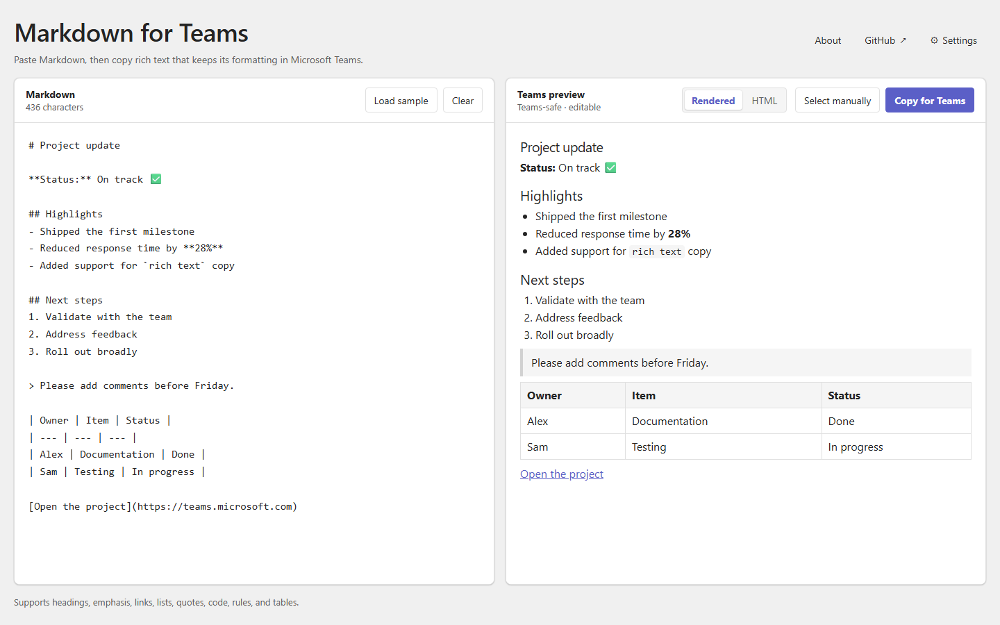

# Markdown to Teams

Microsoft Teams understands some Markdown as you type, but pasted Markdown stays as literal text. Teams does accept a limited set of rich HTML from the clipboard.

This app renders Markdown locally and copies simplified HTML that you can paste into Teams with formatting intact.

To preserve visual quality when pasted into Teams, it applies smart, sometimes non-obvious transformations—especially to headings.



## How transformation works

Markdown is rendered locally, then copied as simplified rich HTML because Teams does not render pasted Markdown.

### Heading modes

Teams renders pasted H3+ headings *smaller* than body text in messages and replies, making them look absurdly tiny. Each mode first normalizes the relative heading hierarchy, then:

| Mode | Behavior |
| --- | --- |
| **Teams-optimized** (default) | Relative levels 1/2 → explicit bold H1/H2; H3+ → bold body text |
| **Native headings** | Every normalized level stays a heading |
| **All bold text** | All headings → bold body text |

The selected mode is remembered in browser `localStorage`.

### Formatting

- Two-space indentation creates nested lists.
- Spacing is context-aware: paragraph breaks are preserved, while headings and lists use native spacing to avoid doubled gaps.

## Copying & privacy

### Copying

- **Copy for Teams** places rich HTML and plain text on the clipboard.
- **Select manually** is a Ctrl/Cmd+C fallback for when clipboard permissions are blocked.
- The **Rendered / HTML** switch shows either the formatted preview or the exact simplified HTML.

### Privacy & drafts

- Content and settings stay local to the browser.
- Draft saving is enabled by default; disabling it in **Settings** deletes the saved draft.

## Local

Requires [Node.js](https://nodejs.org/) and [`just`](https://github.com/casey/just). The command uses `npx` to download and run `serve` automatically at `http://localhost:3000`.

```sh
just run-node
```
